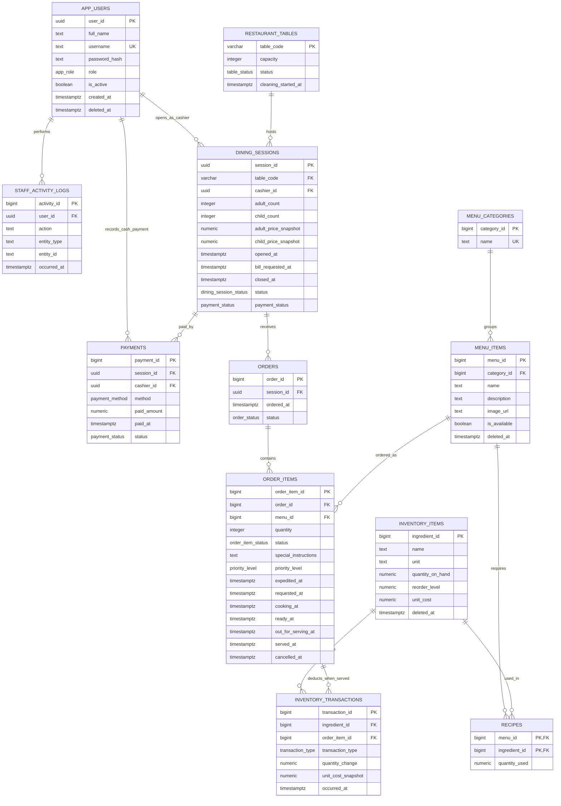

# ER Diagram

This ERD matches the simplified Supabase schema used by the final web application. The system is for an all-you-can-eat restaurant, so menu items do not store selling price. Revenue comes from dining-session adult/child buffet price snapshots and cash payments.

## Relationships And Constraints

| Relationship | Cardinality | Participation / Rule |
| --- | --- | --- |
| `restaurant_tables` to `dining_sessions` | One table can have many historical sessions | `dining_sessions.table_code` is mandatory. A partial unique index allows only one open session per table. |
| `app_users` to `dining_sessions` | One cashier can open many sessions | `cashier_id` is nullable for imported/demo data but normally set by the cashier interface. |
| `dining_sessions` to `orders` | One session can have many customer submissions | Every order belongs to exactly one session. |
| `orders` to `order_items` | One order can contain many menu items | Every order item belongs to exactly one order. |
| `menu_items` to `order_items` | One menu item can appear on many order rows | Every order item references one menu item. |
| `menu_items` to `inventory_items` through `recipes` | Many-to-many | `recipes(menu_id, ingredient_id)` is the composite primary key. |
| `order_items` to `inventory_transactions` | One served order item can deduct many ingredients | `order_item_id` is nullable because manual stock adjustments are not tied to a served item. |
| `dining_sessions` to `payments` | One session can have one or more payment records | Current UI creates one cash payment per completed session. |
| `app_users` to `staff_activity_logs` | One user can create many audit actions | Used for login, workflow actions, manager edits, and soft deletes. |

## Removed From Final Model

- `staff_shifts` is removed because the project no longer tracks shifts.
- `customer_code` is removed because customers are not registered members and the app selects an open session directly.
- `waiter_id` is removed from sessions because many waiters can serve the same table.
- `menu_items.price` is removed because buffet billing is per guest, not per dish.
- `recipe_id` is removed because the composite key `(menu_id, ingredient_id)` already identifies recipe rows.
